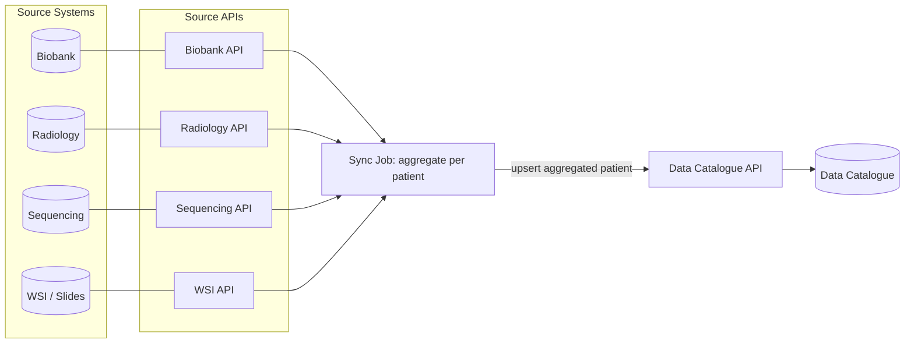

# Architecture Overview

This service synchronizes patient-related data from multiple source systems into the data catalogue.

At a high level:
- each source system exposes its own API,
- the sync job calls those APIs,
- it aggregates source data into one patient-level record,
- and upserts that record to the catalogue.

In one sentence: for each patient, the sync job reads from all source APIs, aggregates the data into one coherent record, and uploads it into the data catalogue.
